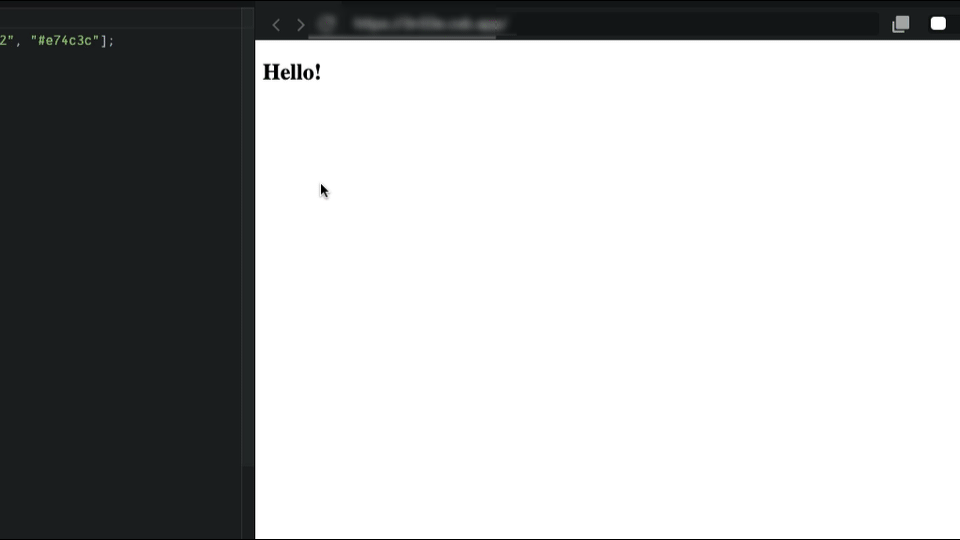

<style>
time.date {
  color : #fff;
}
.imgOption{
    display:flex;
    justify-content:center;
    align-items:center;
    width: 800px; 
}
h2{
    font-weight :bold;
    color : #83dcb7 !important;
    border : 6px solid #83dcb7;
}
h3 {
    font-weight :bold;
    border : 3px solid ;
}
</style>



1. 마우스가 title위로 올라가면 텍스트가 변경되어야 합니다.
2. 마우스가 title을 벗어나면 텍스트가 변경되어야 합니다.
3. 브라우저 창의 사이즈가 변하면 title이 바뀌어야 합니다.
4. 마우스를 우 클릭하면 title이 바뀌어야 합니다.
5. title의 색상은 colors 배열에 있는 색을 사용해야 합니다.
6. .css 와 .html 파일은 수정하지 마세요.
7. 모든 함수 핸들러는 superEventHandler내부에 작성해야 합니다.
모든 조건이 충족되지 못하면 ❌를 받습니다.

## 배운것 
### 1. Object에 들어간 handler 함수들
```js
const superEventHandler = {
  handlemouseEnter: function (e) {
    //console.log(e);
    titleElement.innerText = "The mouse is here!";
    titleElement.style.color = colors[0];
  }
}
titleElement.addEventListener("mouseenter", superEventHandler.handlemouseEnter);
```
위와 같이 메소드 형식으로 (오브젝트임) 핸들러 함수만 따로 관리하게끔 
양식을 작성 할 수 있다.

### 2. window
```js
window.addEventListener("resize", superEventHandler.handleResizeBrowser);
window.addEventListener("mousedown", superEventHandler.handleRightClick);
```
윈도우는 그냥 브라우저 자체를 가르킨다.

### 3. mousedown을 통한 우클릭 좌클릭 판단법
```js
function handleClick(e) {
    console.log(e);
}

window.addEventListener("mousedown", handleClick);
```
위와 같은 코드를 실행시 결과는 다음과 같다

0. 우클릭
1. 휠클릭
2. 좌클릭

그래서 다음과 같이 조건문을 만들 수 있다
```js
function handleClick(e) {
    if(e.butten === 0){}
    else if (e.buttne === 1){}
    else if (e.buttne === 2){}
}
```