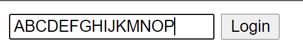

### 1. html attribute를 통한 Range제한
만약 input의 텍스트를 최대 15글자로제한하고 싶으면 다음과 같다. 
1. 일단 form 형태로 작성되어야한다
   * div와 같은걸로 감싸봤자 의미가 없음


```html
<input required maxlength="15" type="text" placeholder="What is your name?" />
```

다음과 같이 아예 더이상 작성이 되질 않는다.