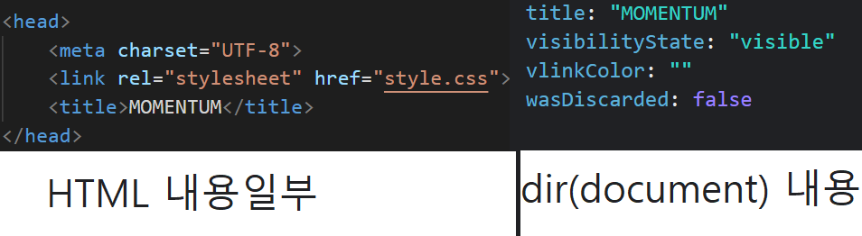
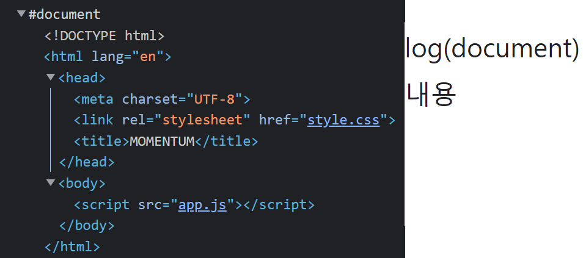
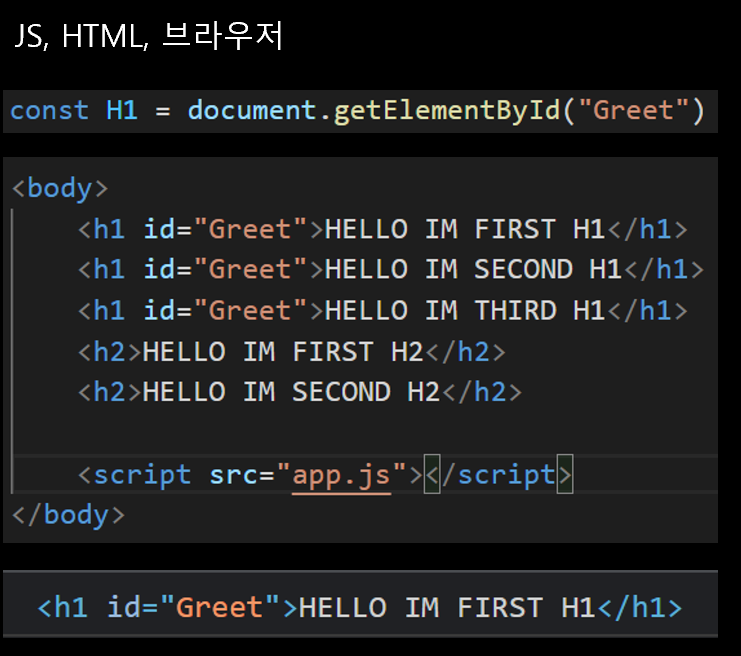

## <span style="color : #83dcb7;">1. JS - document 객체 </span>
사실 HTML과 상호작용하기 위해
HTML의 element를 JS를 통해서 변형하고 작동시키려고..

*document*
document는 HTML을 가르키는 객체다

아래는 **console.log & console.dir** 의 내용
[Console에 대한 이야기](./JS_QA_console.md)




아래와같은 방식으로 HTML을 변화시킬수도 있다.
```js
document.MEMVER = ___
```
## <span style="color : #83dcb7;">2. Element Searching </span>

#### 1. getElementById("*IDNAME*")
1. 주어진 *IDNAME* 과 일치하는 id 속성을 찾고 Element 객체를 반환한다.
2. ID는 유일해야한다. 애초에 하나의 Element만 가져옴

#### 2. getElementByClassName(*"ClASSNAME"*)
1. array 방식으로 가져온다
#### 3. getElementByTagName("*TAGNAME*")
1. array 방식으로 가져온다

### --- 근데.. 이거의 상위호완이 있다 ---

#### 4. querySelector("*CSS_SELECTOR_WAY*");
1. Css 선택자로 선택가능
2. 단 하나의 Element만 가져옴
#### 5. querySelectorALL("*CSS_SELECTOR_WAY*")
1. Css 선택자로 선택가능
2. Array로 가져온다.

### style도 변경 가능


## <span style="color : #83dcb7;">3. Evnet </span>

```
1. click
2. 엔터 누르기
3. wifi 접속 등등..
```

*이벤트 작동시키기*
```js
const title = document.querySelector("div.class"); // -> HTML Element 선택하기

title.addEventListener("Real_EVENT", 그에따 실행할것_FUNC)); 
//단 실행할것이 FUNC이면 ()을 붙이면 안된다.
//() 을 붙이게 된다면 무조건적으로 실행이 되버린다.

```
[이벤트 종류, Mozilla 재단](https://developer.mozilla.org/en-US/docs/Web/API/HTMLElement)
사실.. console.dir()으로도 확인 가능하다.

*clcik*
```
//타겟을 클릭 하면 발생하는 이벤트
document.addEventListener("click", listener);
```

*mouseenter*
```
//마우스커서가 타겟위에 올라가면 발생하는 이벤트
```
*mouseleave*
```
//마우스커서가 타겟위에 없다면 발생하는 이벤트
```

#### More Event
1. 이벤트 리스너 대신 쓸수 있는 방법
```
title.addEventListener(type,listener);
title.type = listener;
```

2. window Evnet
*resize* : 브라우저 크기 변경
*copy* : 카피했을때
*paste* : 붙여넣기 했을때
*offline* : 오프라인
*online* : 온라인