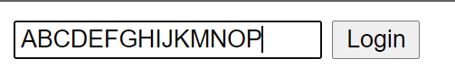
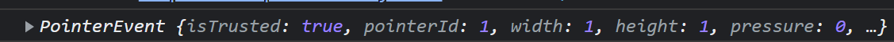

<span style="color : #83dcb7;"></span>
### <span style="color : #83dcb7;">1. html attribute를 통한 Range제한</span>
만약 input의 텍스트를 최대 15글자로제한하고 싶으면 다음과 같다. 
1. 일단 form 형태로 작성되어야한다
   * div와 같은걸로 감싸봤자 의미가 없음


```html
<input required maxlength="15" type="text" placeholder="What is your name?" />
```

다음과 같이 아예 더이상 작성이 되질 않는다.

### 2. <span style="color : #83dcb7;">*_EVENT*.preventDefault()</span>
type에 따른 이벤트를 막는것
기본 동작을 실행하지 않도록 지정합니다.

*submit*
submit의 경우 제출했을시 페이지가 새로고침이 되는 기본 동작이 있다
```html
<input type="submit" value="Login">
```

*click*
click의 경우 클릭 동작을 막는것

*link*
link의 기본동작은 링크로 이동하기

### <span style="color : #83dcb7;">3. 내가실행한 이벤트확인</span>
사용자가 어떤 이벤트를 벌였는지 화인할 수 있다
```
function listener(_E) {
    console.log(_E)
}
_TARGET.addEventlistener(type, listener)
```  


### <span style="color : #83dcb7;">4. 백틱 문자열</span>
```js
`HELLO ${_VAR}`;
```

### <span style="color : #83dcb7;">5. 저장하기</span>
localStorage : Key - Value

개발자 도구에서 Application 메뉴에 확인가능
```js
localStorage.setItem(,,,);
localStorage.getItem(,,,);
   //if 값이 없다면 null값 반환
   //=== 으로 유무판단하자.
```