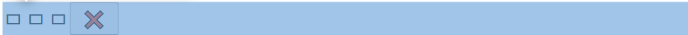
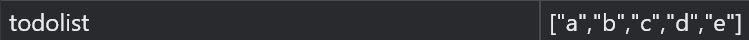

<span style="color : #83dcb7;"></span>
# Greeting.js
### <span style="color : #83dcb7;">1. html attribute를 통한 Range제한</span>
만약 input의 텍스트를 최대 15글자로제한하고 싶으면 다음과 같다. 
1. 일단 form 형태로 작성되어야한다
   * div와 같은걸로 감싸봤자 의미가 없음


```html
<input required maxlength="15" type="text" placeholder="What is your name?" />
```

다음과 같이 아예 더이상 작성이 되질 않는다.

### 2. <span style="color : #83dcb7;">*_EVENT*.preventDefault()</span>
type에 따른 이벤트를 막는것
기본 동작을 실행하지 않도록 지정합니다.

*submit*
submit의 경우 제출했을시 페이지가 새로고침이 되는 기본 동작이 있다
```html
<input type="submit" value="Login">
```

*click*
click의 경우 클릭 동작을 막는것

*link*
link의 기본동작은 링크로 이동하기

### <span style="color : #83dcb7;">3. 내가실행한 이벤트확인</span>
사용자가 어떤 이벤트를 벌였는지 화인할 수 있다
```
function listener(_E) {
    console.log(_E)
}
_TARGET.addEventlistener(type, listener)
```  


### <span style="color : #83dcb7;">4. 백틱 문자열</span>
```js
`HELLO ${_VAR}`;
```

### <span style="color : #83dcb7;">5. 저장하기</span>
localStorage : Key - Value

개발자 도구에서 Application 메뉴에 확인가능
```js
localStorage.setItem(,,,);
localStorage.getItem(,,,);
   //if 값이 없다면 null값 반환
   //=== 으로 유무판단하자.
```

[좀더 정확한 localstorage](./JS_LOCALSTORAGE.md)

----------------------------------------------------------------------------

# Clock.js
### <span style="color : #83dcb7;">1. setInterval/setTimeout </span>
setInterval : 일정 시간간격을두고 함수를 실행하는 방법
setTimeout : 일정시간이 지난후에 함수를 실행하는 방법

### <span style="color : #83dcb7;">2. padStart() </span>
padStart(고정문자열길이, 채울문자)

```js
clockElement.innerText = 
   `
      ${date.getHours()}:
      ${date.getMinutes()}:
      ${parseInt(date.getSeconds()) < 10 ? 
         `0${date.getSeconds()}` : date.getSeconds()}
   `
```
이건 너무 코드가 길어

그래서 다음과 같이 작성하면 된다.
```js 
    const hours = String(date.getHours()).padStart(2,"0");
    const minutes = String(date.getMinutes()).padStart(2,"0");
    const second = String(date.getSeconds()).padStart(2,"0");
    clockElement.innerText = `${hours}:${minutes}:${second}`;
```
# Quotes
### <span style="color : #83dcb7;"> Math.random() </span>

Math.random()
0과 1 사이의 난수를 반환합니다.
Math.round(x)
숫자에서 가장 가까운 정수를 반환합니다.

# BackGround
### <span style="color : #83dcb7;"> document.createElement </span>
바로 적용할수 있는게 아니라
일단 HTML에 들어갈 수 있는 Element를 <> 형식으로 만들 수 있다.

▽ 이제 본격적으로 원하는 위치에 적용하고 싶다면 다음 명령어를 써야한다 ▽
### <span style="color : #83dcb7;"> .appendChild() </span>

# ToDoLIST

[로컬스토리지저장불러오기 꼭 읽어야할것](./JS_로컬스토리지저장불러오기.md)

### <span style="color : #83dcb7;"> 이벤트 발생좌표 </span>
내가 발생시킨 이벤트의 위치가 정확히 어디인지 확인하고 싶을때
1. 이벤트 리스너를 가지고 console.dir출력
2. target이나 좌표를 단서를 얻자
3. target에는 parentElement라는것이 있다. 

버그 발견
```js
function deleteTODO(_E){
    if(_E.target.localName === "button" || _E.target.innerText === "❌"){
        const deleteTarget = _E.target.parentElement.parentElement;
        deleteTarget.remove();
    }
}
```
여기에서 target.localName을 한정하지 않으면 아래의 파란부분의 클릭시

상위 태그의 요소들이 전부 삭제되는 버그가 있다.
따라서 li 부분을 클릭하지 못하게 막아줘야한다.

### <span style="color : #83dcb7;"> JSON</span>
#### JSON.stringify(___)
어떤 정체불명의 데이터를 string으로 변환해주는 코드이다.
따라서 localstorage 저장시 다음을 응용한다면

와 같이 저장가능하다.

### JSON.parge
문자열로 가져온 데이터를 파싱해서 arr으로 저장가능하다.

### <span style="color : #83dcb7;"> Array</span>
*forEach*
```js
parsedTODOs.forEach(i => {
    console.log(i);
    });
```
*filter(__하나의 원소를 받고 -> T/F로 반한되는 조건문혹은 함수__)*
O(N)으로 진행되는 삭제명령어
true -> 삭제 안됨
false -> 삭제
```
filter(sextFunction)
sextFunction(원소){
    ...원소값을가지고 조건문 만들기...
    return T/F; 
}
```

```
at: ƒ at()
concat: ƒ concat()
constructor: ƒ Array()
copyWithin: ƒ copyWithin()
entries: ƒ entries()
every: ƒ every()
fill: ƒ fill()
filter: ƒ filter()
find: ƒ find()
findIndex: ƒ findIndex()
findLast: ƒ findLast()
findLastIndex: ƒ findLastIndex()
flat: ƒ flat()
flatMap: ƒ flatMap()
forEach: ƒ forEach()
includes: ƒ includes()
indexOf: ƒ indexOf()
join: ƒ join()
keys: ƒ keys()
lastIndexOf: ƒ lastIndexOf()
length: 0
map: ƒ map()
pop: ƒ pop()
push: ƒ push()
reduce: ƒ reduce()
reduceRight: ƒ reduceRight()
reverse: ƒ reverse()
shift: ƒ shift()
slice: ƒ slice()
some: ƒ some()
sort: ƒ sort()
splice: ƒ splice()
toLocaleString: ƒ toLocaleString()
toString: ƒ toString()
unshift: ƒ unshift()
values: ƒ values()
```

### <span style="color : #83dcb7;"> Map-Array Element를 특정하자</span>
어느 데이터가 지워져야하는지 식별하기위핸 id가 포함된 데이터를 만들자.
```
const map {
    key : value;
}

array.push(map());
```
