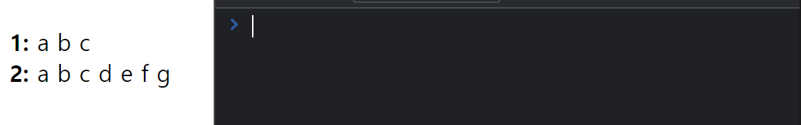
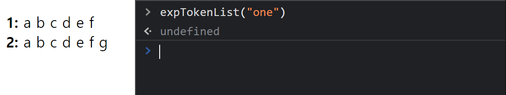
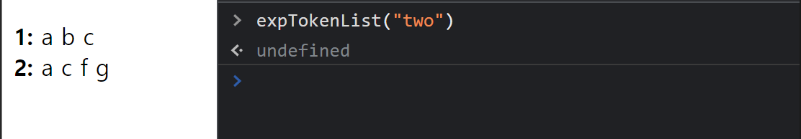
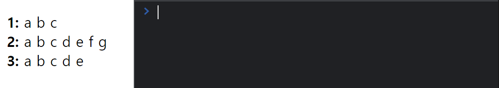
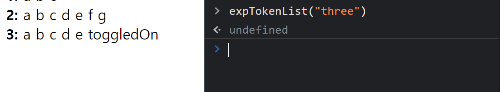
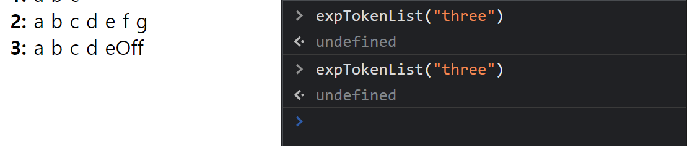
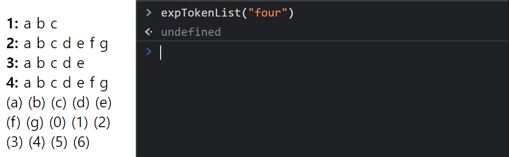
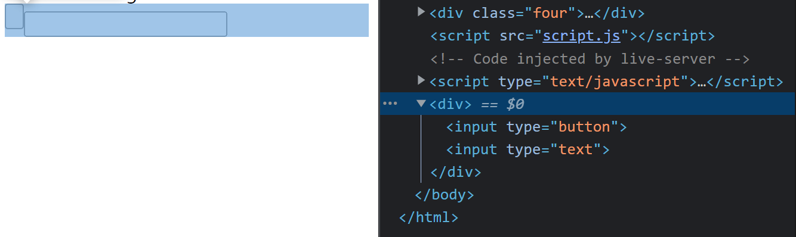
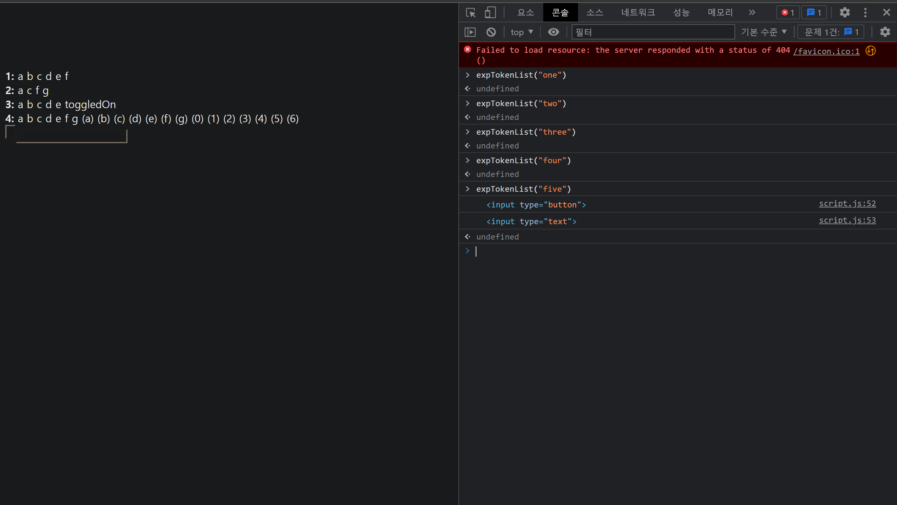

<style>
time.date {
  color : #fff;
}
.imgOption{
    display:flex;
    justify-content:center;
    align-items:center;
    height: 200px; 
}
h2{
    font-weight :bold;
    border : 6px solid #83dcb7;
    color : #83dcb7 !important;
}
h3 {
    font-weight :bold;
    border : 3px solid ;
}
</style>

## DOM 이란 
**Document Object Model**
* 웹 페이지를 스크립트 또는 PL로 연결한다.
* HTML 과 같은 Documnet의 구조를 보여줌으로
  * DOM은 문서를 tree 형식으로 보여준다
    * 각 트리 분기에는 Node가 있고 Node는 Object를 포함시킨다.

**DOMTokenList**
  * &#95;Element&#95;.classList로 반환되는 토큰집합이다.
  * 인덱싱 가능

## DOMTokenList
---
### 1. 이미 존재하는 Element
#### 1. 선택하자 quarySelector("")
* **1. 부모 자식관계가 뚜렷한 선택**
  * &#95;부모tag&#95; > &#95;자식tag > .... > &#95;잼민이tag&#95;

* **2. 여러개의 클래스가 있다면 어떻게 다 선택할까?**
  * &#95;tag&#95;.tag의클래스1.tag의클래스2.tag의클래스3 ...    

* **3. attribute과 속성의 값 모두선택**
  * &#95;tag&#95;[myAttribute=aValue]

* **4. 값 가져오기**    
  * input의 값
    * &#95;Element&#95;.value
        ```JS
        console.log(newInput.value)
        ```
  * input이 아닌 텍스트는
    * &#95;Element&#95;.textContent
      ```JS
      console.log(newDiv.textContent)
      console.log(newDiv.InnerText)
      ```
---

#### 2. 수정하자
* **1. InnerText 백틱 문자열**
    ```JS
    _수정할텍스트_ = `${}`
    ```
* **2. ClassList**
    * **1. &#95;Element&#95;.classList.add()**
        ```JS
            add(token0);
            add(token0, token1);
            add(token0, token1, /* ... ,*/ tokenN)
        ```
      1. 
      2. 
    
    * **2. &#95;Element&#95;.classList.remove()**
        ```JS
            remove(token0);
            remove(token0, token1);
            remove(token0, token1, /* ... ,*/ tokenN)
        ```
      1. 
      2. 
    
    * **3. &#95;classList&#95;.toggle(callback)**
        * 토글하면서 다음을 리턴
            1. true
            2. false
      1. 
      2. 
      3. 
    * **4. &#95;classList&#95;.contains(token)**
        * 리턴
          1. true
          2. false
       
    * **5.  &#95;classList&#95;.item(index)**
      * 인덱스형식으로 접근한다
      * 위 방법 말고 &#95;classList&#95;[index]라고 적어도 된다
    
    * **6. 클래스리스트 value(), keys**
      *  

Hidden의 활용법
CSS 조작

---

### 2. 아예 있지도 않은 Element


#### 없는 Element를 만들고 삭제하자
#### 1. 만들기
* **1. |document/Element|.createElement("&#95;tag&#95;")**
  1. 그렇다면 속성 추가는 어떻게 하는건가?
        ```JS
        |_createdElement/Element_|.setAttribute(_myAttribute_, _aValue_)
        ```
    * 엘리먼트를만들고 속성도 정해주고 싶다면 무조건 따로 명시해줘야한다
    * 안그러면 에러 생긴다.
  2. 클래스를 추가하려면?
     * classList 사용

* **2. createTextNode()**
  * 아래 내용 확인하기

* **3.|createdElement/document/Element|.appendChild()("&#95;tag&#95;")**

*  


---

#### 2. 삭제하기
* **1. &#95;선택한Element&#95;.remove()**
* **2. &#95;선택한부모Element&#95;.removeChild(&#95;선택한부모Element&#95;.childNodes[index]**

---

### 3. innerText textContent createTextNode()
* createTextNode()는.. 텍스트 Element를 만드는것이라 생각해야한다.
* createElement이지만 문자열을 매개변수로 텍스트를 받는것
```
    근데.. 굳이 써야하는지..
        1. newDiv.textContent ="가 나 다 라"

        2. const newText = document.createTextNode("가 나 다 라")
        newDiv.appendChild(newText);

        1. newDiv.innerText ="가 나 다 라"
```

## 직접 눈으로 보기
1. 깃허브로 만든 사이트에 들어간다
2. F12 클릭
3. 콘솔에 expTokenList() 쳐보기
   * expTokenList("one") : 클래스 리스트 add
   * expTokenList("two") : 클래스 리스트 remove
   * expTokenList("three") : 클래스 리스트 toggle
   * expTokenList("four") : 클래스 리스트 keys, value
   * expTokenList("five") : 클래스 리스트 createElement

[실행해보자](https://dogguyman.github.io/JS_Element_Doc_ForMe/)

