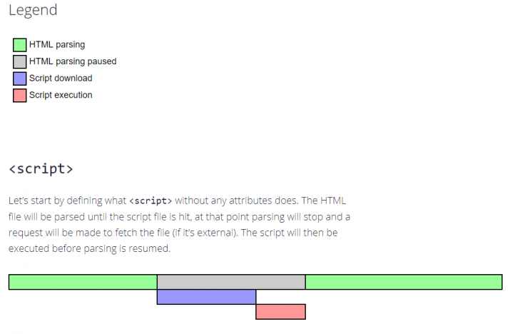

# HTML에서 자바스크립트 포함하는 방법
### 어떤 순서대로 사용자가 웹을 보게될까?

다음과 같이 script 위치만 바꿔도 함수와 변수가 
정의되지 않았다면서 script 불러오는걸 실패했다고 나온다.

야매로 얻은 해결책 2가지가 있다
1. 우선순위가 높은순으로 html script 순서를 바꾼다 
   * 
   * 다음은 quotes.js내부의 randomIndex 함수와 명언Data가 필요하다.
   * 따라서 다음 순서로 호출하면 해결은 된다.
2. defer이라는 속성을 quotes.js HTML 에 추가한다.
   * 대충 검색했을때는 defer은 모든 스크립트가 불러오기전까지 실행을 보류한다는 느낌이다.
   * 

### 웹페이지 로드는 script의 위치에 따라 바뀔수 있다.
**HTML parsing**
* 파싱(parsing: 구문 분석)은 하나의 프로그램을 런타임 환경이 실제로 실행할 수 있는 내부 포맷으로 분석하고 변환하는 것을 의미합니다. 즉, 파싱은 문서의 내용을 토큰(token)으로 분석하고, 문법적 의미와 구조를 반영한 파스 트리(parse tree)를 생성하는 과정입니다.

# defer
1. HTML 파싱되는동안 병렬적으로 script를 다운한다. (공통점) :다운로드 시간 절약
2. HTML 파싱이 최종 종료되야지(페이지 구성이 끝나야지) script 실행이 된다 (차이점)

다만 script가 적용 되기도 전에 페이지가 생성된다.

그리고 defer 스크립트는 TML에 추가된 순(상대순, 요소순)으로 실행됩니다. **작은 스크립트는 먼저 다운되지만, 실행은 나중에 됩니다.**

순서에 의존적인 JS 호출에 유용하다.

# async 
load first order
1. HTML 파싱되는동안 병렬적으로 script를 다운한다. (공통점) :다운로드 시간 절약
2. script다운이 끝난순간 HTML 파싱 멈추고 script 실행한다. (차이점)

이지 로딩을 막지 않기 때문에 페이지 콘텐츠가 바로 출력됩니다.비동기 스크립트는 HTML 문서가 완전히 다운로드되지 않은 상태라도 로드 및 실행될 수 있습니다.

async 스크립트가 여러 개 있는 경우, 그 실행 순서가 제각각이 됩니다. 실행은 다운로드가 끝난 스크립트 순으로 진행됩니다.

------------------------------

### 출처
https://rottk.tistory.com/entry/%EC%99%B8%EB%B6%80-JavaScript-%EB%B6%88%EB%9F%AC%EC%98%A4%EA%B8%B0-async-defer#toc3
https://ko.javascript.info/script-async-defer
