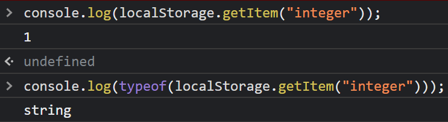
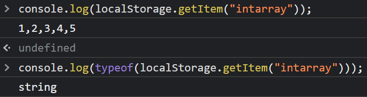
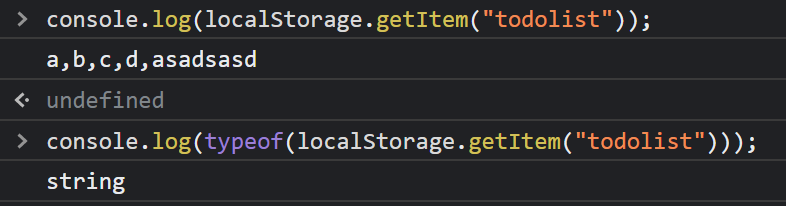
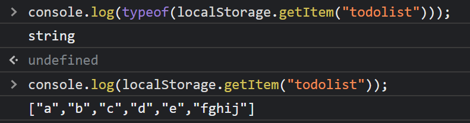

<style>
time.date {
  color : #fff;
}
.imgOption{
    display:flex;
    justify-content:center;
    align-items:center;
    width: 800px; 
}
h2{
    font-weight :bold;
    border : 6px solid #83dcb7;
}
h3 {
    font-weight :bold;
    border : 3px solid ;
}
</style>

### 1. 저장하기
로컬 스토리지 저장은 Key-value 형식으로 저장된다.
value는 단일값이든, 배열이든 저장을하긴하는데 String 형식으로 저장한다.

단일값

여러값이 정수라면


여러값이 문자열이라면


```py
if (단일값이면) :
    그냥 단일값 저장해도 상관 없다
else (여려값 저장하려면) : 
    if(여러 값이 정수라면 단, array 형식으로 저장되는것이 아님) : 
        setItme(key, __array__) 
        >> 1,2,3,4,5
        하면 된다.
    else (여러 값이 문자열이라면 || array 형식으로 저장하고싶다면 "[]") :
        문자열 배열을 문자열로 저장한다는 의미가 되는데.
        
        setItem(key ,JSON.stringify(__array__)) 
        >> []
        로 저장해야한다. 그렇지 않으면 JSON 파싱을 못함  
```
### 2. 불러오기 
localStorage에 값이 없다면 null 반환
```py
if (여러 값이 문자열이라면 || array 형식으로 저장하고싶다면 "[]") 
을 불러오고 싶다면.

savedTODOs = localStorage.getItem(TODOLIST_KEY);
parsedTODOs = JSON.parse(savedTODOs);
```